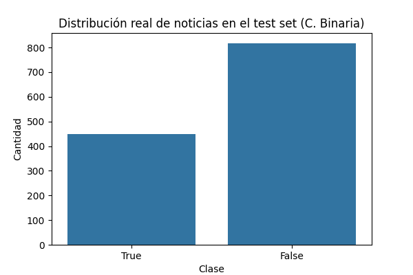
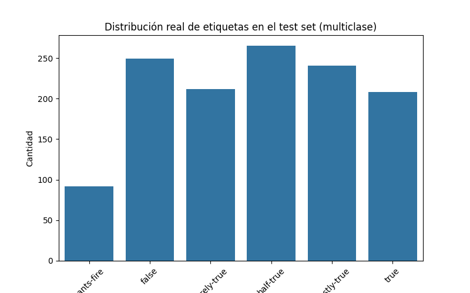
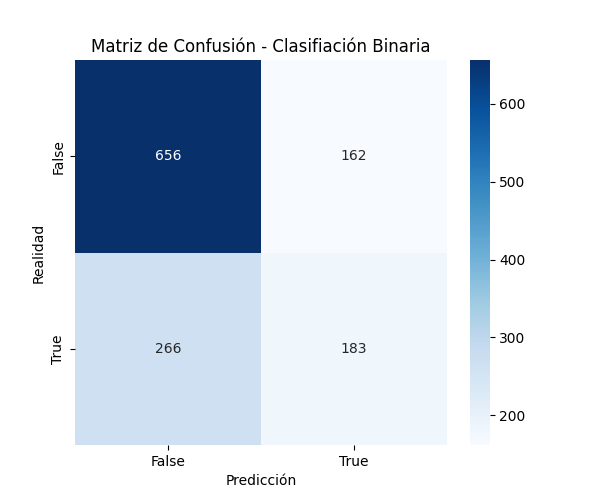
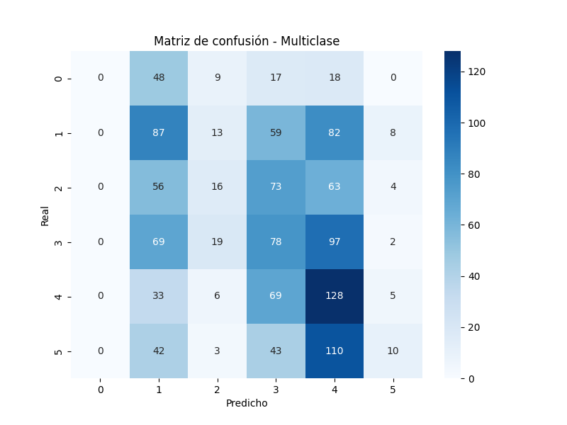

# Fake News Detection using BERT

Natural language processing project focused on automatic fake news detection using Transformer-based classification models.

---

## Overview

This project explores automatic fake news detection using deep learning and natural language processing techniques.

Two different classification approaches were implemented using BERT base uncased:

- Multiclass classification with six levels of truthfulness.
- Binary classification separating statements into true or false categories.

The project also analyzes how simplifying the classification task impacts model performance.

Main components of the project include:

- Text preprocessing and cleaning
- Transformer-based NLP classification
- Fine-tuning using Hugging Face Transformers
- Binary and multiclass evaluation
- Confusion matrix analysis
- Class distribution visualization

---

## Dataset

The models were trained and evaluated using the LIAR dataset, a benchmark dataset composed of political statements labeled according to their degree of truthfulness.

Original labels include:

- pants-fire
- false
- barely-true
- half-true
- mostly-true
- true

For the binary classification task, the labels were regrouped into two categories:

| Original Labels | Binary Class |
|---|---|
| pants-fire, false, barely-true, half-true | False |
| mostly-true, true | True |

Dataset split:

- Training set: 10,256 samples
- Validation set: 1,284 samples
- Test set: 1,267 samples

---

## Methodology

The workflow included the following stages:

1. Text preprocessing and cleaning
2. Tokenization using the BERT tokenizer
3. Fine-tuning BERT for text classification
4. Training and validation
5. Performance evaluation on test data

### Text Preprocessing

The preprocessing pipeline included:

- Lowercasing
- URL removal
- Special character cleaning
- Whitespace normalization

---

## Model Architecture

The project uses:

- BERT base uncased
- Hugging Face Transformers
- PyTorch

The classification head was adapted depending on the task:

- 6 output classes for multiclass classification
- 2 output classes for binary classification

---

## Training Configuration

| Parameter | Value |
|---|---|
| Epochs | 3 |
| Batch size | 16 |
| Learning rate | 2e-5 |
| Optimizer | AdamW |

---

## Technologies

- Python
- PyTorch
- Hugging Face Transformers
- Scikit-learn
- Pandas
- NumPy
- Matplotlib
- Google Colab
- Jupyter Notebook

---

## Evaluation Metrics

The models were evaluated using:

- Accuracy
- Precision
- Recall
- F1-score
- Confusion matrices

The comparison between binary and multiclass classification allows analyzing how label simplification affects model performance.

---

## Results

### Binary Class Distribution



---

### Multiclass Distribution



---

### Binary Confusion Matrix



---

### Multiclass Confusion Matrix



---

## Main Findings

- Binary classification achieved better overall performance due to the simpler label structure.
- Multiclass classification was significantly more challenging because several categories have overlapping semantic meaning.
- Class imbalance affected the binary setup, particularly for the true class.
- Confusion matrices helped identify the categories most difficult to classify.

---

## Repository Structure

```text
notebooks/      -> training and evaluation notebooks
images/         -> figures and visual results
report/         -> project report
presentation/   -> project presentation
```

---

## Future Improvements

Possible extensions of this project include:

- Comparison with RoBERTa and DistilBERT
- Class imbalance mitigation techniques
- Explainability methods such as SHAP or LIME
- Hyperparameter optimization
- Real-time fake news detection API

---

## Author

Ana Fuentes Rodríguez.  
BSc in Physics | MSc in Data Science and Computer Engineering
